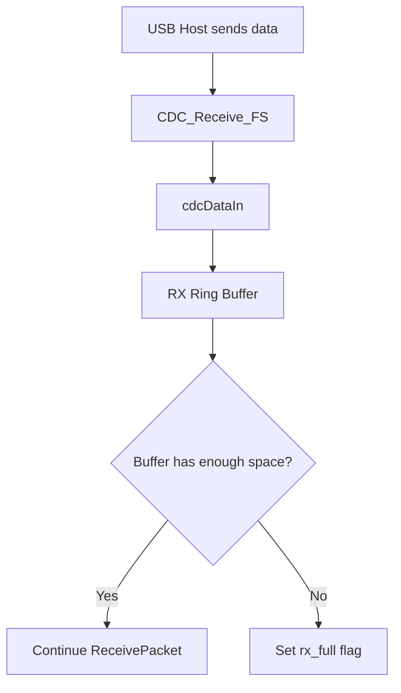
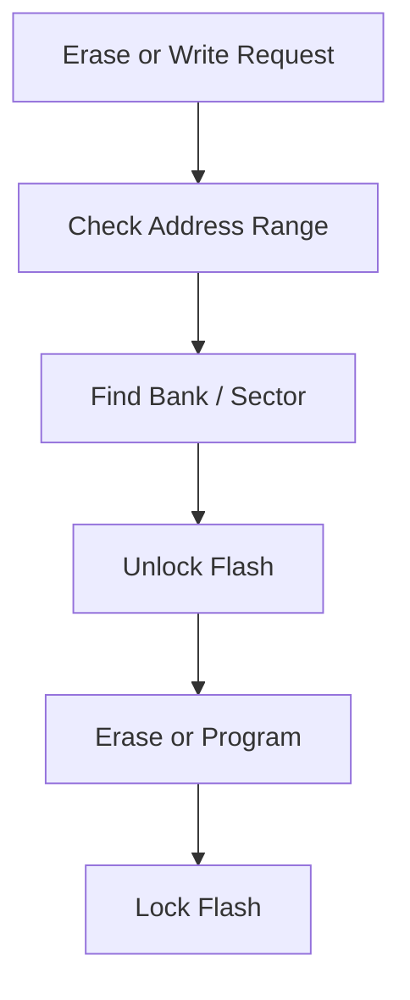

# stm32-usbcdc-flash-driver

##  개요
이 프로젝트는 STM32 환경에서 다음 두 가지 핵심 기능을 구현한 프로젝트입니다.

- **USB CDC 통신**: PC와 보드 간 데이터 송수신
- **Internal Flash제어**: erase / write / read 동작 구현

즉, 외부 호스트로부터 데이터를 입력받고,
MCU 내부의 비휘발성 메모리를 제어하는 임베디드 시스템의 기본 입출력 경로를 구성하는 것을 목표로 했습니다.

---

##  Why CDC and Flash?

USB CDC는 STM32 보드를 PC와 **가상 COM 포트(Virtual COM Port)** 형태로 직접 연결할 수 있어
테스트와 디버깅에 유리하다고 판단하여 선택했습니다.
별도의 외부 통신 장치 없이도 호스트와 데이터를 주고받을 수 있어,
이후 명령 처리 기능으로 확장하기에도 적합합니다.

Flash는 임베디드 시스템에서 설정값, 로그, 상태 정보 등
전원이 꺼져도 유지되어야 하는 데이터를 저장하는 핵심 자원이기 때문에 선택했습니다.
erase / write / read를 구현하면서
섹터 단위 삭제, 주소 정렬(alignment), bank 구분, 메모리 맵 기반 접근 방식까지 확인할 수 있었습니다.

By combining CDC and Flash, this project forms a basic embedded workflow:

**Host communication -> data buffering -> internal storage handling**

즉, 이 프로젝트는
**호스트와의 통신 경로(USB CDC)** 와
**MCU 내부 비휘발성 저장소 제어(Flash)** 를 함께 다루며,
임베디드 시스템의 기본적인 데이터 입출력 구조를 구성하는 데 목적이 있습니다.

비록, CLI까지 확장하지는 못했지만
그 전 단계에서 필요한 핵심 기반 기능은 구현하였습니다.

---

##  개발환경

- MCU: STM32
- Framework: STM32Cube HAL
- USB Class: CDC (Virtual COM Port)
- Language: C
- IDE / Toolchain: STM32CubeIDE

---

##  디렉터리 구조

```text
APP/
└── src/
    ├── ap/        application layer
    ├── bsp/       board support package
    ├── common/    shared utilities
    ├── hw/        hardware drivers
    ├── lib/       STM32CubeMX generated code
    ├── main.c
    └── main.h
```

---

##  실행 흐름

`main.c`에서는 시스템 시작 후 `hwInit()`와 `apInit()`을 통해 초기화를 수행하고,  
이후 `apMain()`으로 진입하여 애플리케이션의 메인 동작을 실행하도록 구성했다.

이를 통해 초기화 코드와 실제 동작 로직을 분리하고, 상위 계층에서 기능 흐름을 관리할 수 있도록 했다.

---

##  CDC 구현 내용

USB CDC는 STM32 보드를 PC와 **Virtual COM Port** 형태로 연결하기 위한 통신 인터페이스로 구현했다.  
STM32Cube USB Device CDC 구조를 기반으로 하되, 
애플리케이션 레벨에서 사용할 수 있도록 별도의 RX 버퍼 관리 로직을 추가했다.

### 구현 내용
- USB CDC 인터페이스 초기화
- Host의 line coding 정보(baudrate, parity, stop bit, data bit) 관리
- 수신 데이터를 저장하기 위한 **512바이트 RX 링버퍼** 구성
- 수신 데이터 길이를 조회하는 `cdcAvailable()` 함수 구현
- 버퍼에서 1바이트씩 읽는 `cdcRead()` 함수 구현
- 수신 데이터를 버퍼에 적재하는 `cdcDataIn()` 함수 구현
- 송신 시 `CDC_Transmit_FS()`를 이용하고, busy 상태를 고려해 timeout 기반 재시도 로직 추가

### 동작 방식
USB OUT endpoint로 수신된 데이터는 `CDC_Receive_FS()`에서 처리되며,  
수신된 각 바이트는 `cdcDataIn()`을 통해 RX 링버퍼에 저장된다.

버퍼에 여유 공간이 충분한 경우 다음 패킷 수신을 계속 진행하고,  
공간이 부족한 경우에는 `rx_full` 플래그를 설정하여 overflow 상황을 추적하도록 했다.

송신은 `cdcWrite()`를 통해 수행되며, 내부적으로 `CDC_Transmit_FS()`를 호출한다.  
송신 중 USB CDC 상태가 busy인 경우 일정 시간 동안 재시도하며, 
timeout이 발생하면 실패로 처리하도록 구성했다.

---

##  Flash 구현 내용

Flash 모듈은 STM32 내부 Flash 메모리에 대해 **erase / write / read** 기능을 수행하도록 구현했다.  
단순 HAL 함수 호출에 그치지 않고, 주소 범위에 따라 필요한 sector와 bank를 판별하는 로직을 함께 구성했다.

### 구현 내용
- STM32F429 Flash sector 정보를 테이블 형태로 정의
- 시작 주소를 기준으로 **Bank 1 / Bank 2** 구분
- 지우려는 주소 범위와 실제 sector가 겹치는지 판단하는 `flashInSector()` 구현
- 해당 범위에 포함되는 sector 개수를 계산하여 `flashErase()` 수행
- `flashWrite()`에서 halfword(2바이트) 단위로 Flash programming 수행
- `flashRead()`에서 memory-mapped 방식으로 데이터 읽기 수행

### 동작 방식
`flashErase(base, size)`는 입력된 시작 주소와 길이를 기준으로  
어떤 sector들이 해당 범위와 겹치는지 확인한 뒤, 필요한 sector만 erase 하도록 구성했다.

`flashWrite(base, p_data, size)`는 Flash의 기록 단위를 고려하여  
2바이트 정렬 주소를 기준으로 halfword 단위 programming을 수행한다.

`flashRead(base, p_data, size)`는 Flash 메모리 주소를 직접 읽는 방식으로  
지정한 크기만큼 데이터를 버퍼에 복사한다.

이 과정을 통해 내부 비휘발성 메모리의 실제 제약 조건인  
**sector 단위 erase**, **정렬 조건**, **bank 구분**, **메모리 맵 기반 접근**을 직접 확인할 수 있었다.

또한 Flash는 RAM과 달리 erase 이후에만 write가 가능하다는 특성을 고려하여
erase → program → read 흐름을 기반으로 동작하도록 구성했다.

---

##  블록 다이어그램

### 전체 구조


### CDC 수신 흐름


실제 표시:



### Flash 처리 흐름


실제 표시:



## 향후 확장 방향

현재 구현은 USB CDC 통신과 내부 Flash 제어 기능을 각각 독립적으로 구성하는 데 초점을 맞추었다.  
이후에는 두 기능을 상위 로직에서 연동하여, 
외부 입력을 기반으로 Flash를 제어할 수 있는 형태로 확장할 수 있다.

### 확장 방향
- CDC 입력 데이터를 기반으로 한 명령 처리 구조 추가
- Flash write 이후 검증(read-back verification) 로직 추가
- 버퍼 overflow 상황에 대한 예외 처리 보강
- 상태 메시지 및 에러 응답 처리 추가
- 애플리케이션 계층과 하드웨어 제어 계층 간 인터페이스 정리

이 프로젝트는 통신과 저장이라는 핵심 기능을 먼저 구현한 뒤,  
상위 제어 구조로 확장할 수 있도록 기반을 구성하는 데 목적이 있다.

